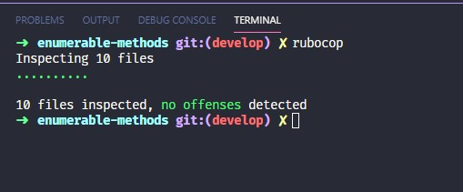

# enumerable-methods
Rebuilding ruby enumerable methods from scratch. The objective of this project was to make a reverse-engineering on the enumerable methods of ruby and learning how they work.

# Validations

Rubocop:



# Features

* Enumerable methods rebuilt
    + [x] [`all?`](https://ruby-doc.org/core-2.6.3/Enumerable.html#method-i-all-3F)
    + [x] [`any?`](https://ruby-doc.org/core-2.6.3/Enumerable.html#method-i-none-3F)
    + [x] [`count`](https://ruby-doc.org/core-2.6.3/Enumerable.html#method-i-none-3F)
    + [x] [`each_with_index`](https://ruby-doc.org/core-2.6.3/Enumerable.html#method-i-each_with_index)
    + [x] [`each`]()
    + [x] [`inject`](https://ruby-doc.org/core-2.6.3/Enumerable.html#method-i-inject)
    + [x] [`map`](https://ruby-doc.org/core-2.6.3/Enumerable.html#method-i-map)
    + [x] [`none?`](https://ruby-doc.org/core-2.6.3/Enumerable.html#method-i-none-3F)
    + [x] [`select`](https://ruby-doc.org/core-2.6.3/Enumerable.html#method-i-none-3F)
* Tests made with [`RSpec`](https://relishapp.com/rspec/)

# How to use it

## Pre requisites

* Being a regular human being, a wizard or a highly trained monkey
* `Ruby` v2.6.3+
* Open a terminal
* Run a command from a terminal

## Testing the methods

* Open a terminal 
* Type `rspec -fd`
* Press `ENTER` and see all the test go green

## Using the methods

Call our code with a `require \"main.rb\"` and start using it like:

```ruby
[1,2,3].my_each {|i| p i}
```

# Built With
* Ruby v2.6.3
* `rvm`
* RSpec
* VsCode
* Windows + WSL
* Love and passion for code ❤️

# Authors

🇧🇷 [Izaias Neto](https://www.github.com/izaiasneto4)
🇨🇴🇸🇻 [Israel Laguan](https://www.github.com/Israel-Laguan)
